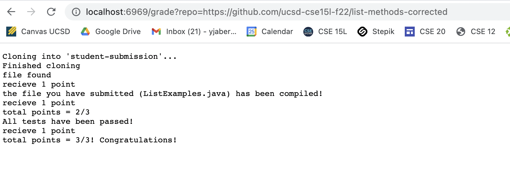
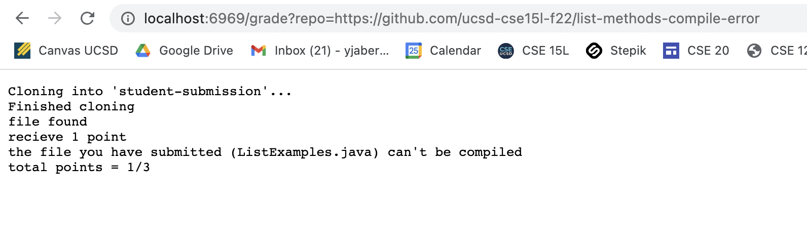
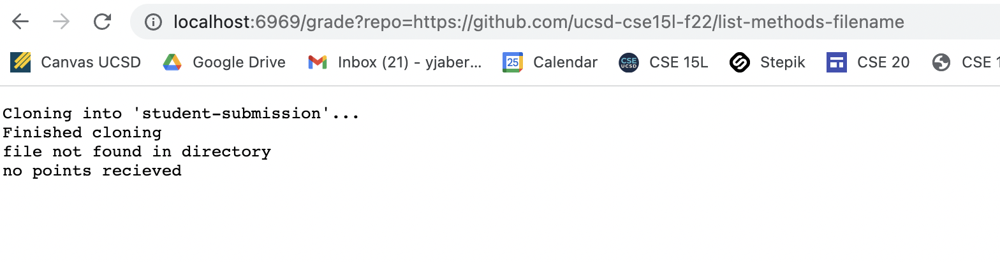

# Week 9- Lab 5 (Autograder)

## **Part 1:** My grade.sh in a code block

```
set -e

CPATH=".:hamcrest-core-1.3.jar:junit-4.13.2.jar"

rm -rf student-submission
git clone $1 student-submission
echo 'Finished cloning'

cp lib/hamcrest-core-1.3.jar student-submission
cp lib/junit-4.13.2.jar student-submission
cp TestListExamples.java student-submission/

cd student-submission/

if [[ -f "ListExamples.java" ]]
then 
    echo "file found"
    echo "recieve 1 point"
    

else 
    echo "file not found in directory"
    echo "no points recieved"
    exit

fi


javac ListExamples.java 2> error.txt > output.txt 
if [ $? -eq 0 ]
then
    javac -cp $CPATH TestListExamples.java 2> error.txt > output.txt
    echo "the file you have submitted (ListExamples.java) has been compiled!"
    echo "recieve 1 point"
    echo "total points = 2/3"
else
    echo "the file you have submitted (ListExamples.java) can't be compiled"
    echo "total points = 1/3"
    exit
fi

java -cp $CPATH org.junit.runner.JUnitCore TestListExamples 2> error2.txt > output.txt
if [ $? -eq 0 ]
then
    echo "All tests have been passed!"
    echo "recieve 1 point"
    echo "total points = 3/3! Congratulations!"
    exit
else
    echo "You have failed one or more tests"
    echo "total points = 2/3"
    exit
fi

```
____

## **Part 2:** Screenshots of Autograder working with 3 different repositories.

* Below is a screenshot of the autograder runnning for the repository that includes the file in which both methods corrected and working properly. As shown below, the autograder awarded the student with 3/3 points, one for finding the file, one for compiling, and one for passing all tests.



* Below is a screenshot of the autograder runnning for the repository that includes a file that doesn't compile. As shown below, the autograder awarded the student with only 1/3 points, only for finding the file.



* Below is a screenshot of the autograder running for the repository that includes a file that doesnt have the correct name. As shown below, the didnt award the student any points and exited the program after telling the user that the file that it was looking for was not in the directory. 



____

## **Part 3:** Walking through the autograder script. 

The example that I chose to explain is example three in which the file doesnt have the correct name. Below is a screenshot of the output of this:


To begin, The repository is cloned using the link. The return code for this would be zero because the repository was cloned successfully. After the cloning of the repository, I copy "lib/hamcrest-core-1.3.jar" and "lib/junit-4.13.2.jar" into the student-submission directry so that the junit tests can run successfully. Additionally, I copy TestListExamples.java into the student-submission directory in order to have all the files needed to run and test the submission. All of these return codes were zero because they all ran successfully and were able to be copied into the directory. Next, I switched directories into the student-submission directory in order to be able find the file so that I can run and compile the files together. In order to check if the file needed is in the directory, I used an if statement. In this case, the if statement was looking for a file named "ListExamples.java" in the student-submissions directory. Since the file had a different name, the if statement was false and the else statement ran instead. The else statement cause the program to echo that the file was not found and exit the program. 

