# Week 1- Lab 1 (Remote Access and Filesystems)

## Step 1: Install VSCode

* I didn't have to do this step because I already had VSCode downloaded on my PC. 

* The the screenshot below shows how the VSCode program looked when I opened it. 

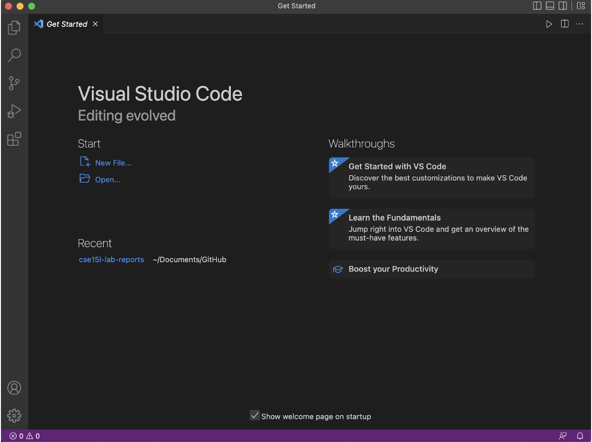

___

## Step 2: Remotely Connecting

* One of the first things that I did before logging into the remote server was changing my password. The process took around 5 minutes (while following the instructions given), however it took around 20 minutes for the password change to take effect. I tried entering in my password multiple times and was denied access to the remote server. below is  a screenshot of my failed attempts at logging in.

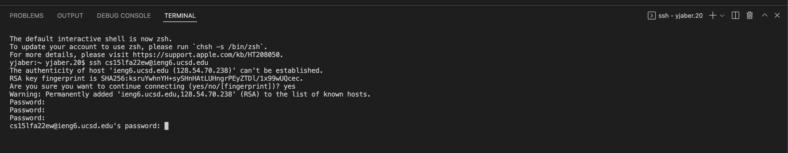

* Eventually ( after 20 mins), I was able to login successfully. Below is a screenshot of my first successful server connection. 

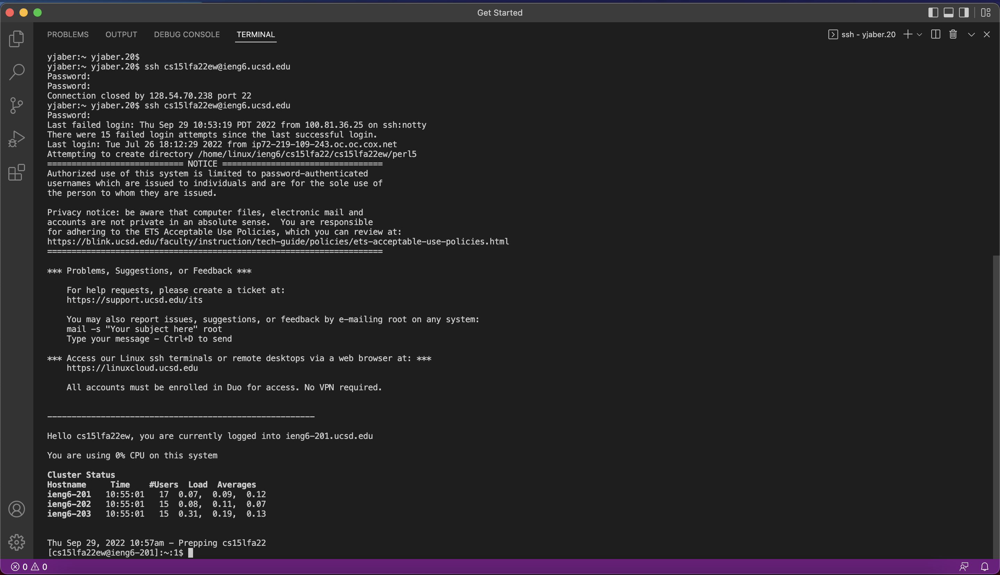

___

## Step 3: Trying some Commands

* After my successful login, I started experimenting with some commands such as cd and ls so that I can get more comfortable with using these terminal commands. Below is a screenshot of some of the commands that I tried to run on the remote server. 

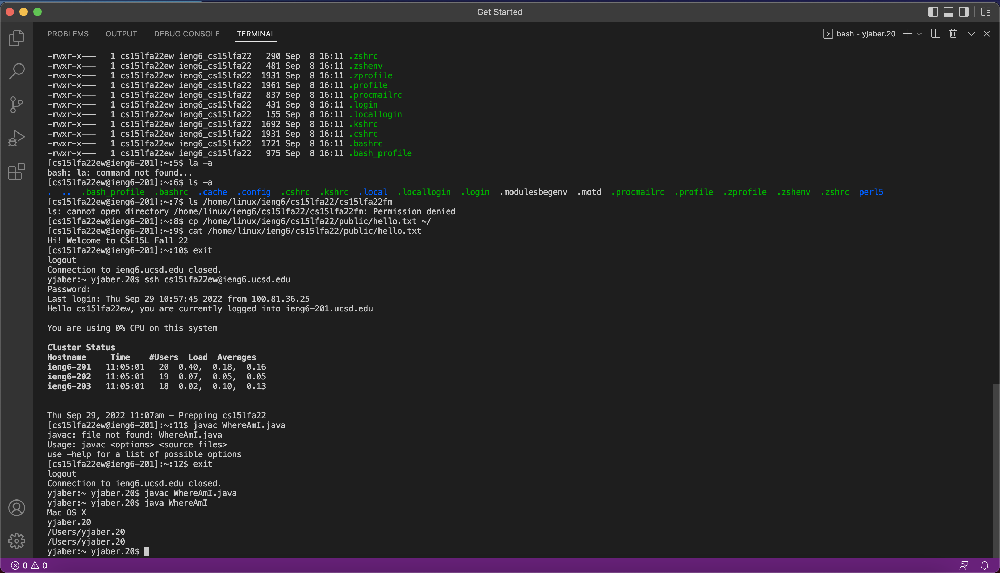

* On a new window, I wrote down the code for the WhereAmI class. I then compiled it and made sure that it was running properly. Below is a screenshot of this.

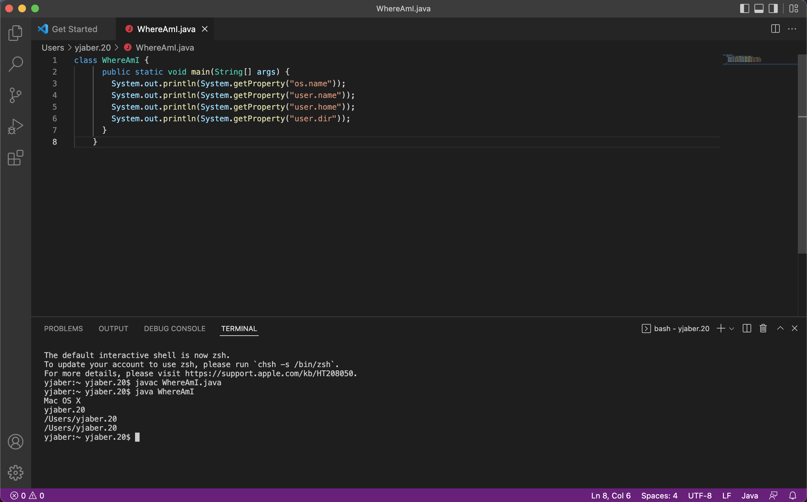

___

## Step 4: Moving Files with scp

* After making sure that the WhoAmI class ran properly on my client, (I made sure that running the code printed out the properties of my personal computer), I typed in the scp command. This command moved the WhereAmI file to the remote server computer. I made sure that this command worked properly by running the code again on the remote server and making sure that the printed results were properties of the remote server and not my computer. 

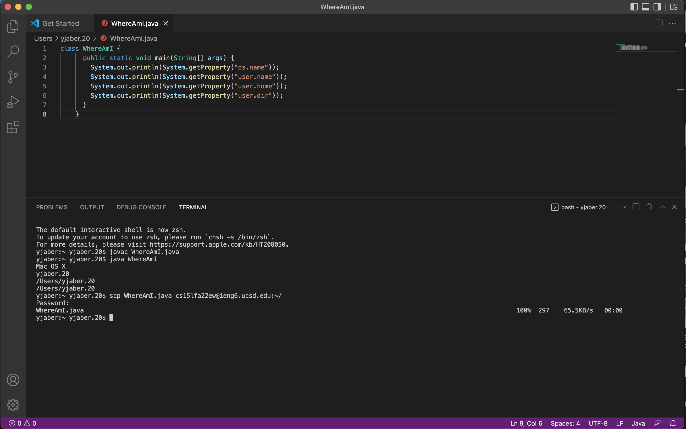

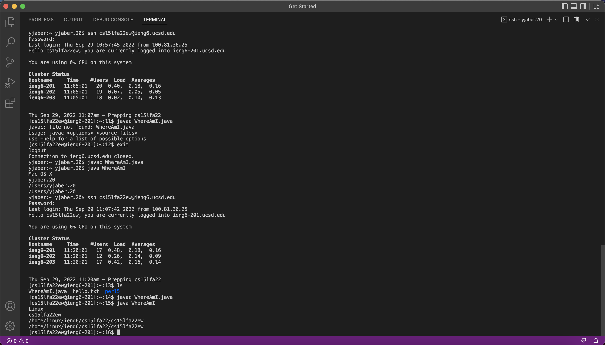

* I then changed parts of the WhereAmI file so that it prints out extra lines, then I ran it and moved the file to the remote server and ran it there. I timed my self and the whole process took around 2 mins 51 secs. 

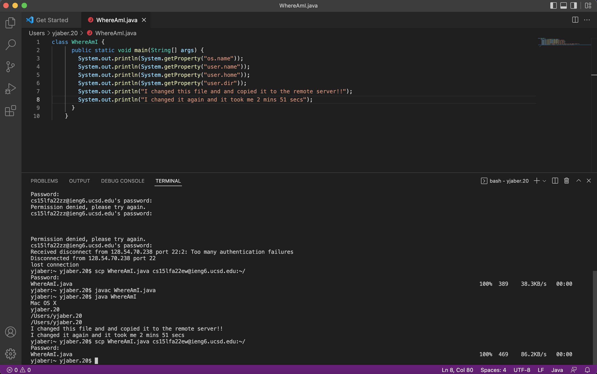

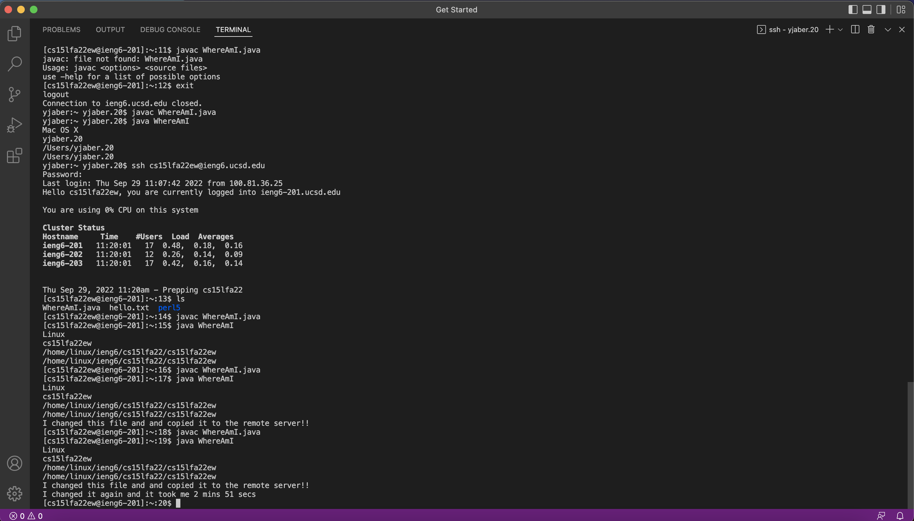

___

## Step 5: Setting an SSH Key

* In order to connect to the remote server without having to put the password in every time I set up an SSH Key. First I ran the command ssh-keygen. After this I went through the promts that came up on the screen by first pressing enter to specify the default path, then I left the passphrases empty so that I can more easily connect to the server. Next I copied the public key to the .ssh directory of my user account on the server. 

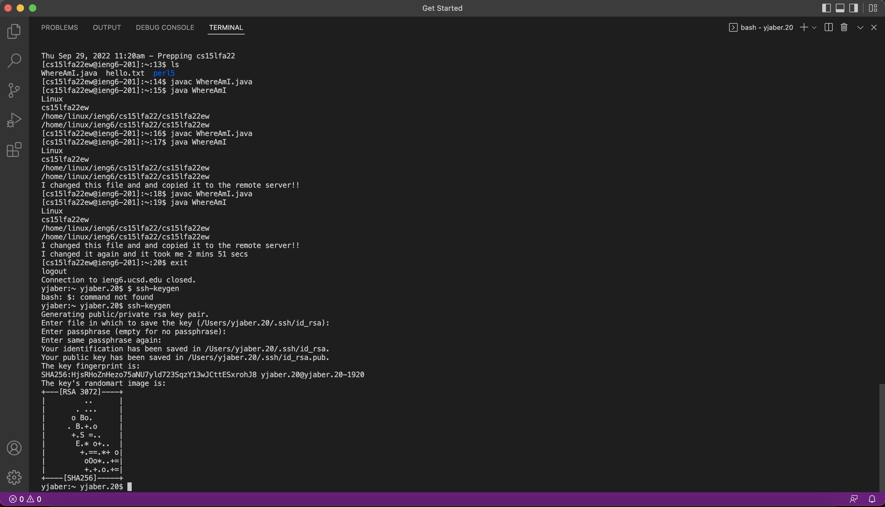

* The screenshot below shows me successfully logging into the remote server without needing a passowrd, indicating that I successfully set up the SSH Key.

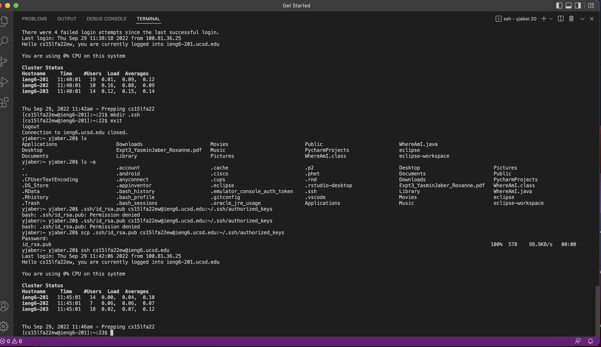

___

## Step 6: Optimizing Remote Running

* I was able to optimize The above process by completeing in with 5 keystrokes. The first keystroke would be the up button which would give us the scp command and the ssh commannd together separated by a semicolon. Then I would press enter to run both of these commands that move the file to the remote server and logs into to the remote server. Then I pressed the up button twice which would give me the line: javac WhereAmI.java; java WhereAmI. This compiles and runs the file on the remote server. 

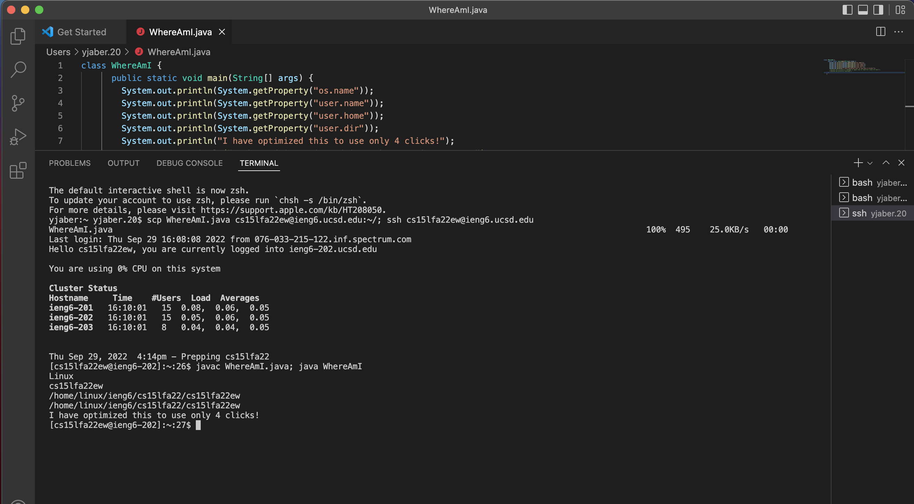