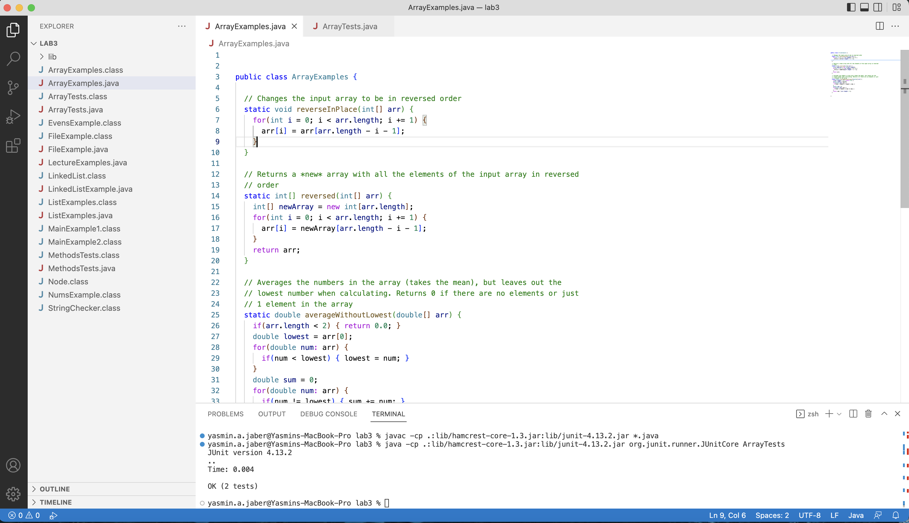
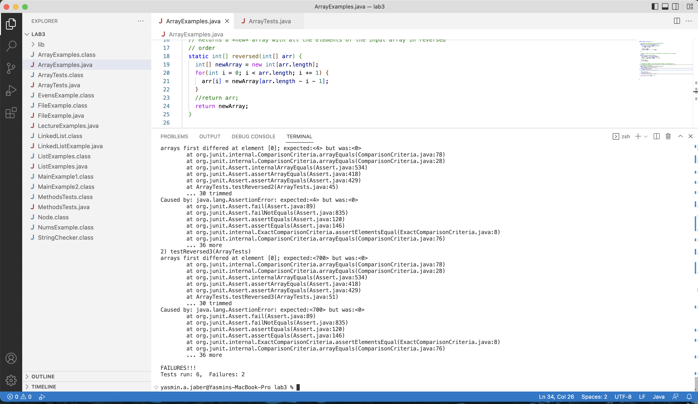
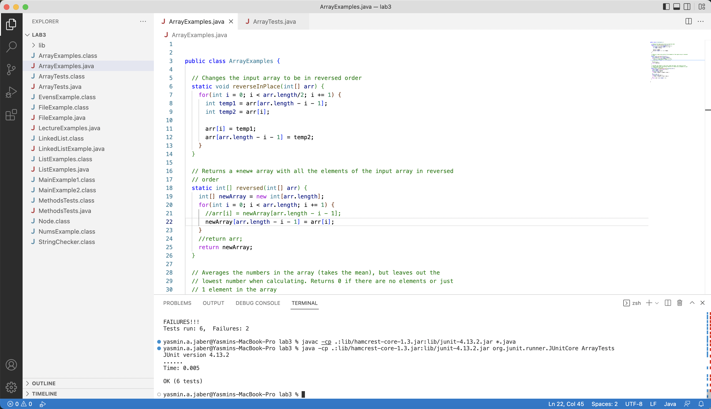
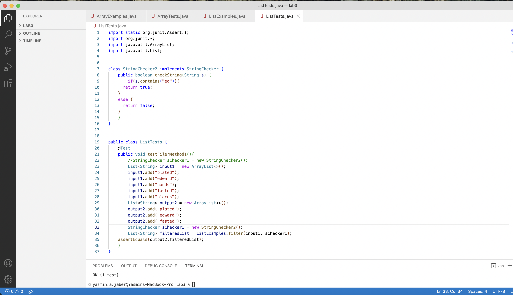
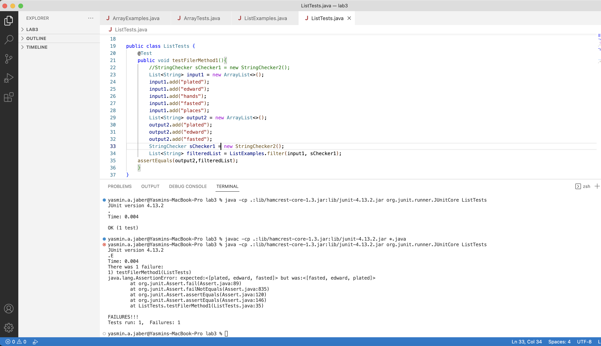
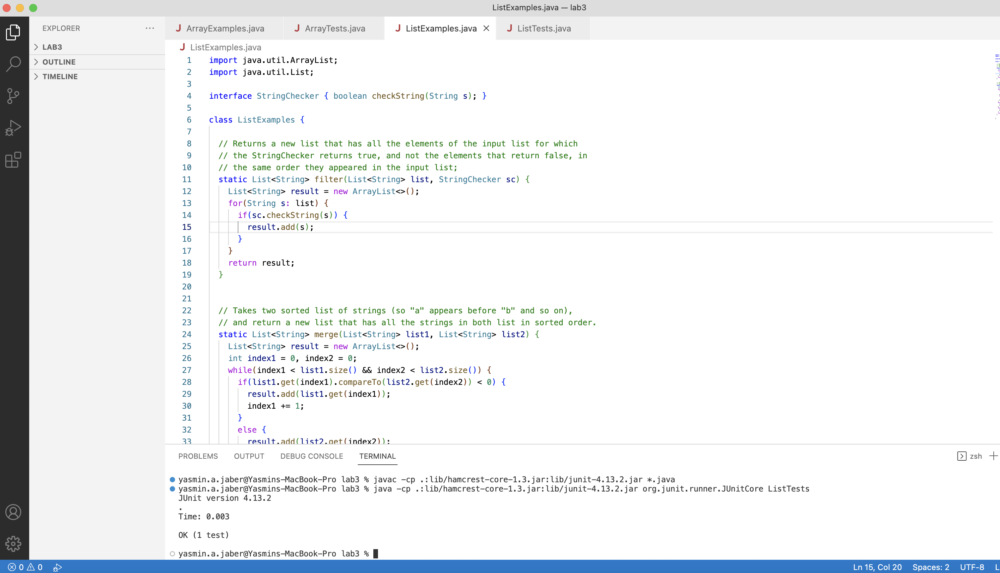

# Week 3- Lab 2 (Search Engine and Debugging)

## Part 1: Simplest Seach Engine

## Part 2: Debugging

**Bug 1: ArrayMethods reverse**

The first method that I decided to debug was the reversed array in the arrayExamples file. WHen I first opened the file and ran the initial that were pre written, they all passed. Since I knew for a fact that all the methods in the arrayEamples file have at east 1 bug, I knew that the pre written tests are not good enough to identify the given bug. Below is a screenshot of the initial unedited file and after I ran the two prewritten tests. 

After these tests passed, I realized taht I would need to write more tests in order to be able to find the symptom and identify the bug. I wrote two different tests, reverseTest1 and reverseTest2, both of which failed and returned as the method kept returning a 0 value instead of the arrays in reverse. For reverseTest1, I made the input array {1,2,3,4}, and expected to get an output of {4,3,2,1}, but I actually got a result of 0. For reverseTest2 I creted an input array with the values {100,300,500,700} and expected to get an output of {700, 500, 300 ,100} but I also got a result of 0. Therefore I considered these 2 input arrays to be the failure inducing input and the symptom of both was that the method returned a result of 0. Below is a screenshot of the tests and the expected outputs in comparison to the actual output. 

After looking back at the code I realized that there must be an issue in that no items were being added to the array or that the return value is incorrect. Sure enough I was able to identify that a bug taht i assumed to be the symptom. That bug was that the return statement was returning the original arr array rather than the newArray. I fixed this bug and tried to run the tests but the tests kept failing. Below is a screenshot of this. 

This made me realize that there must be another bug that is preventing the items from being added to the newArray. After looking at the code further I realized that there is also a bug in line 21 in which it says arr[i]=newArray[arr.length-i-1]. This is a bug because it is changing the value of arr to be the value of newArray instead of assigning the value from arr to NewArray. I fixed this bug by replacing line 21 with newArray[arr.length-i-1] = arr[i]. This caused the new array to take the values of 0 and didnt allow anything to be added to the newArray, which is why we I kept gettting an output of 0 rather than the reversed arrray. After I changed this and ran the tests again they all passsed. Below is a screenshot of the fixed code and the passed tests. 

**Bug 2: List reverse**

The second method that I tried to debug is the filter method in the ListExamples file. This method is meant to return a new list that has all the elements of the input list for which the StringChecker returns true, and not the elements that return false, in the same order they appeared in the input list. Before being able to test this, I needed to implement the StringChecker method by creating a new class called StingChecker2 that implements the StringChecker interface. I needed to do this because I needed to create a string checker object and you cannot create objects from interfaces. After creatig the class, I created the implementation for the string checker which selects teh strings that have "ed" in them. Below is a screenshot of this implementation and the test that I created to try and identify the bug. 

After running the test I found got the following results. 

Instead of giving me the results in the same order as they were but filtered ([plated, edward, fasted]), it gave me the results in reverse ([plated, edward, fasted]). Therefore the failure inducing inout was the array [plated, edward, hands, fasted, places] and the symptom was the properly filtered, but reversed list ([plated, edward, fasted]). This made me realize that the bug does have anything to do with the stringChecker method, but rather has something ti do with the way in which the items are added to the new results array. After looking at it further realized that teh bug was in line 15, where it was adding teh item in idex 0, meaning that the item that was added first ended up shifting down the array because the other items were being added to index 0 after. I fixed this bug by removing the 0, and leaving it as (s). I then ran the test and it passed. Below is a screenshot of the test passing and the fixed bug. 

