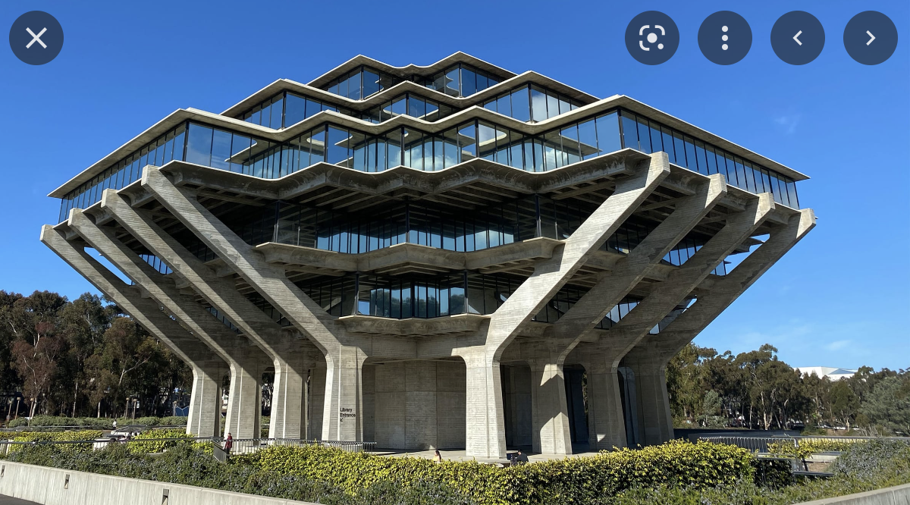

# First GitHub Page

**Hello, world! This is my first GitHub file.**

The link to my GitHub page can be accessed through clicking [*this button*](https://yasminaj1.github.io/cse15l-lab-reports/)

*this is a cool picture of Geisel library* 

>Hello, world! (again)

***

## My top 3 favorite dining halls at UCSD:

1. Makai *(sixth college)*
2. 64 *(revelle college)*
3. noodles *(sixth college)*

***

# Useful links:

1. The link to my [index page](https://yasminaj1.github.io/cse15l-lab-reports/index.html)

2. The link to my [lab report 1 page](https://yasminaj1.github.io/cse15l-lab-reports/lab-report-1-week-0.html)

