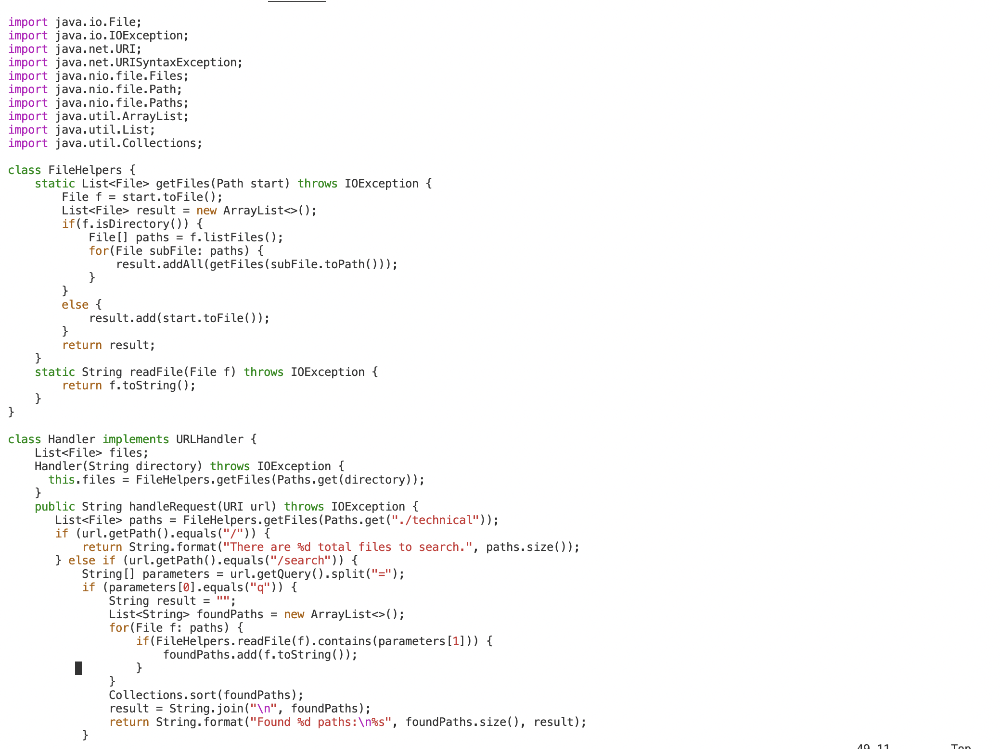
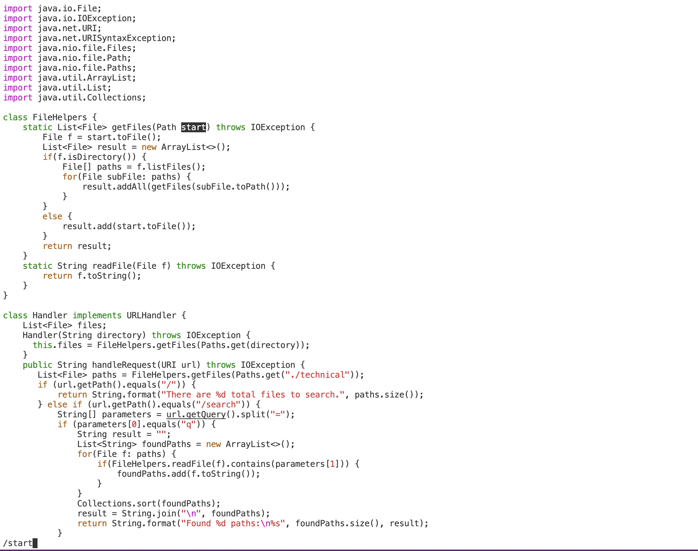
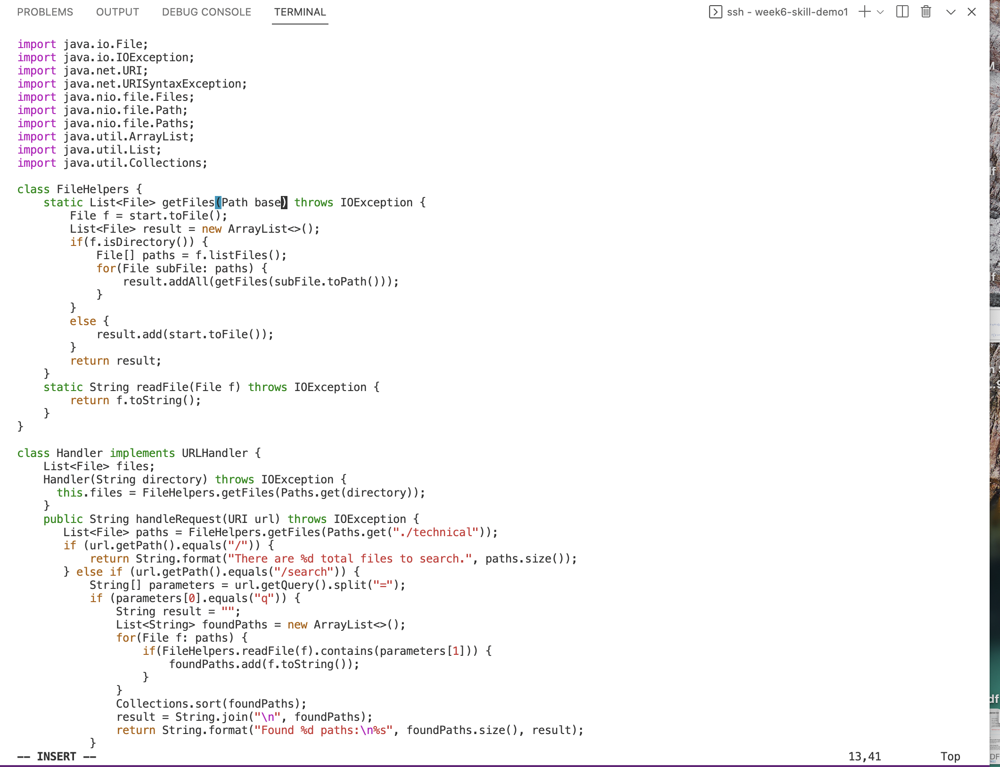
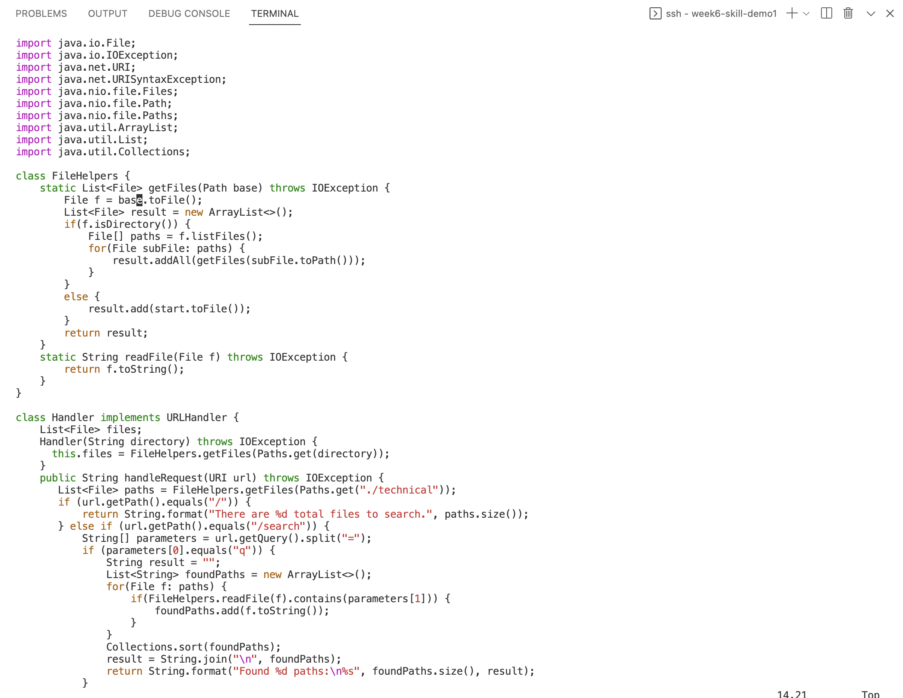
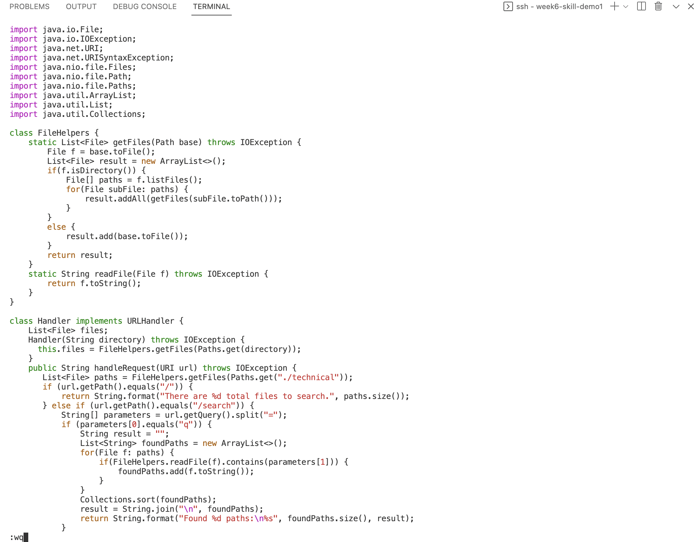

# Week 7- Lab 4 (Editing files using vim)


## **Part 1:** Changing the name of the start parameter and its uses to base

The commands used are as follows: 

```

vim DocSearchServer.java
/start <Enter>
ce 
base
<Esc>
n 
.
n
.
:wq
<Enter>

```
____
* The first command I typed into the terminal (after logging into the remote server and cloning the repository) was the vim DocSearchServer.java. This command allows us to edit the file DocSearchServer.java usinhg vim. Below is a screenshot of the terminal after I ran this command.



* After that I typed /start and [Enter]. Typing "/" followed by a word or a phrase searches for the this phrase. I did this instead of using the cursor because its faster and more efficient as it used less keys. Below is a screenshot of this. 



* After this, I typed in ce, which is used when you want to change until the end of the word. ce allowed me to edit the sord start and chnage it into base. Below is a screenshot of the word start being chnaged into base using ce. 



* Then, I typed in n. twice. according to the vimtutor, to search for the same phrase again and chnage it to how you cnhanged the first instance of it, you shoukd type "n" followed by "." (a period). I did this twice because there are two instances of the word start (other than the one that I manually changed) that need to be changed to base. Below is a screenshot of what happened after I typed "n.".



* Finally, I typed :wq and [Enter] which is the way that you save the file and exit using vim. Below is a screenshot of this. 




## **Part 2:** Running programs remotely

**Question 1: Which of these two styles would you prefer using if you had to work on a program that you were running remotely, and why?**

* I would personally prefer to start in Visual Studio Code and make the edit there, then scp the file to the remote server and run it there to confirm it works rather than starting in an already logged in ssh session and editing the file using vim and running the tests there. I think I prefer the firts method because although vim has many options and ways to efficiently edit files, I feel more comfortable using vscode because I am more comfortable wth editing a file that way and I feel like I can be more certain that I didnt make any syntax errors before scp the file to the remote server. However, i believe taht if someone was to get comfortable enough using vim , by practicing alot, It could be faster and more efficient to just edit the file through vim on the terminal. 

**Question 2: What about the project or task might factor into your decision one way or another? (If nothing would affect your decision, say so and why!)**

* I dont think anything would factor into my decision other than maybe if the edits that needed to be made were very minor (such as very few edits of very simple edits). If this was the case I would consider using vim. But in general, I dont think I am comfortable enough with vim yet to be able to make major edits and be sure that I didn't make more mistakes in the file. 